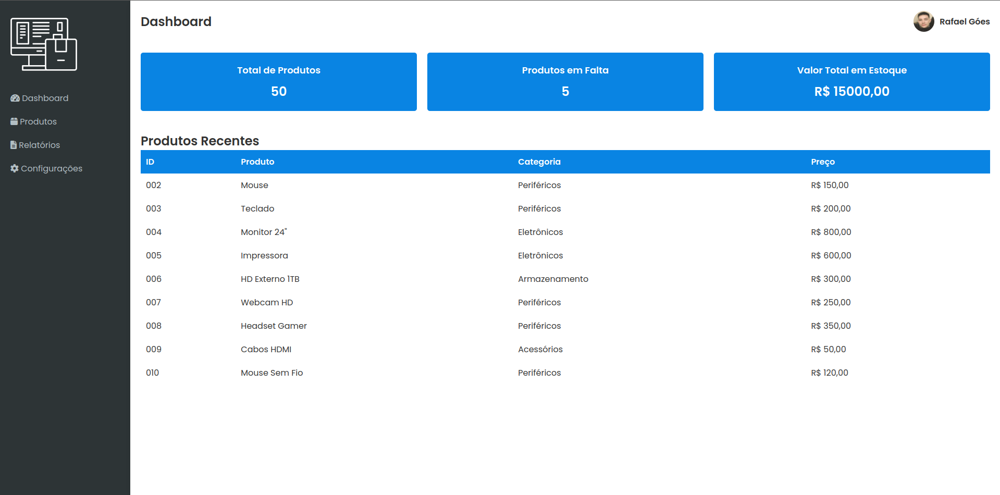

# 📦 Sistema de Gerenciamento de Estoque

Este é um sistema de gerenciamento de estoque que permite visualizar, adicionar e gerenciar produtos de forma simples e eficiente.

## 📋 Funcionalidades

- **Dashboard**: Visão geral do estoque com métricas como total de produtos, produtos em falta e valor total em estoque.

- **Gerenciamento de Produtos**: Adicione, edite e exclua produtos do estoque.
- **Relatórios**: Gere relatórios detalhados sobre as vendas e produtos.

## ⚙️ Tecnologias Utilizadas

- **HTML**: Estrutura básica do site.
- **CSS**: Estilização da interface.
-**PHP**: Interação com banco de dados
- **JavaScript**: Funcionalidades interativas, como busca de produtos.

## 📁 Estrutura do Projeto

```
.
├── imagens
│   ├── logo.png
│   └── rafael.jpeg
├── index.html
├── dashboard.html
├── produtos.html
├── relatorios.html
├── configuracoes.html
└── style.css
```

## 🚀 Como Executar

1. Clone o repositório:
   ```bash
   git clone https://github.com/seu-usuario/nome-do-repositorio.git
   ```

2. Navegue até o diretório do projeto:
   ```bash
   cd nome-do-repositorio
   ```

3. Abra o arquivo `index.html` em um navegador.

## 🎨 Estilo

Utiliza a fonte **Poppins** do Google Fonts e ícones do **Font Awesome** para uma melhor experiência visual.

## 📄 Licença

Este projeto está licenciado sob a [MIT License](LICENSE).

## 📫 Contato

Se você tiver alguma dúvida ou sugestão, sinta-se à vontade para entrar em contato:

- **Email**: rafaelgoesti2021@gmail.com
- **LinkedIn**: [rafaelgoesti](https://www.linkedin.com/in/rafael-goes-06b3342aa)

---

Desenvolvido com ❤️ por [Rafael Góes](https://github.com/rafaelgoesti).